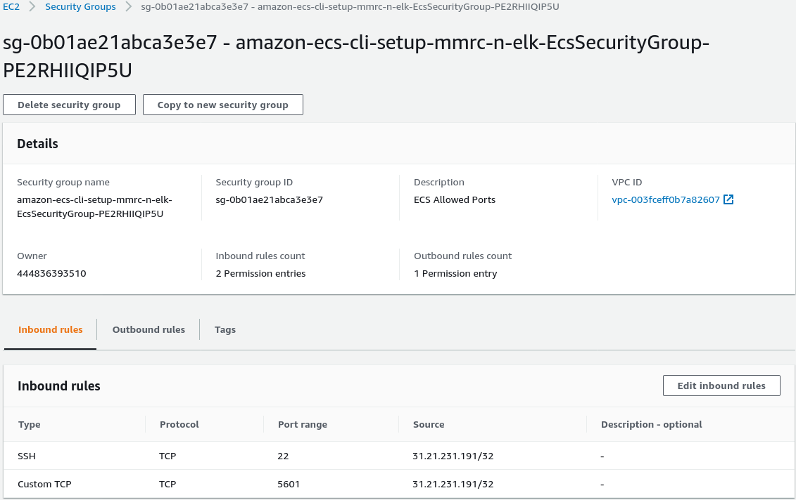
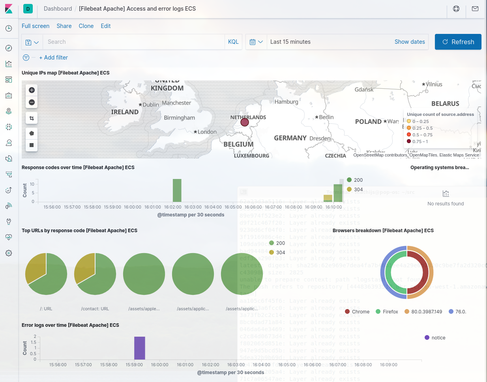

Welcome to my take on the Nike challenge. This document will walk through all
the steps needed to setup the whole thing. But before we begin we need to
install some tools. I'm using an Ubuntu-like distribution, so YMMV.

# Prepare for installation

```
sudo apt install docker.io
sudo apt install docker-compose
sudo adduser mathijs docker
```

Some tools are installed directly from internet. Terraform from
`https://www.terraform.io/downloads.html`. I'm using version v0.12.25

`ecs-cli` is installed via:
`https://docs.aws.amazon.com/AmazonECS/latest/developerguide/ECS_CLI_installation.html`
and
`https://docs.aws.amazon.com/cli/latest/userguide/install-cliv2-linux.html`

Some more tools:
```
sudo apt install amazon-ecr-credential-helper
sudo apt install jq # needed for the docker image build script
```

Also, before going any further, make sure you have a working AWS account and
have an SSH-keypair setup. Mine is called `mmrc` so change the commands
accordingly.

# Task 1: docker-compose ELK stack.

After creating a `docker-compose.yml`-file version 3.2 and have everything
setup in there, I downgraded the version to 3 when I discovered that `ecs-cli`
needs to have that version. So some of the original features were dropped.
```
docker-compose up
```
when in the current directory. This should start the environment.
Connect to it via: `http://localhost:5601`. Then
go to 'stack monitoring' and setup self-monitoring. This will show all
components being green.

When you are done playing around with this, simply stop everything by
```
docker-compose down
```

# Task 2a: AWS ECS ELK stack.

Using the above `docker-compose.yml` you can use `ecs-cli` to deploy to
AWS ECS. Note that I'm using my ssh keypair: `mmrc` for this. Please replace
that with your ssh-keypair. I also created an `ecs-params.yml` file to
fine tune configuration for ECS that is not exposed in the `docker-compose`
file

```
aws configure
ecs-cli configure --region=eu-west-1 --cluster=mmrc-elk
ecs-cli up --capability-iam --instance-type t3.large --size 1 --keypair mmrc
ecs-cli compose service up
```
This will deploy the ELK stack to AWS ECS. On order to reach this stack
we need to modify the security group setup by `ecs-cli`. In the AWS console:

EC2 -> security groups -> find the one created by ecs-cli and add the following
rules:


Replace the above IP address with your own or 0.0.0.0/0 to allow the rest
of the world a view. Now find the EC2 instance IP and connect to it via:
http://52.49.7.174:5601.  Again we can setup the self-monitoring to validate
the setup.

Stop the whole thing using:
```
ecs-cli compose service down
ecs-cli down
```

# Task 2b: AWS ECS ELK stack using terraform.

The following terraform setup is a bit more involved. We will setup
load-balancers here as well to allow the cluster to grow and have
multiple instance of all the components to work together. We are also
going to use persistent storage (EFS).

Before we can run the setup terraform code we need to create some custom
docker images. This is done by the top-level script: (make sure `jq`
is installed)
```
./build_ecs_images.sh
```
This will build and upload the docker images used.

The terraform code resides in the `terraform` sub-directory. Make sure to
update the `terraform.tfvars` file. Provide information about your
ssh-keypair, your IP and the ECR repository of the account you are using.

```
region="eu-west-1"
instance_type="t3.large"
availability_zone_1="eu-west-1a"
availability_zone_2="eu-west-1b"
ecs_key_pair_name="mmrc"
public_cidr="31.21.231.191/32"
elasticsearch_image="444836393510.dkr.ecr.eu-west-1.amazonaws.com/elasticsearch:latest"
logstash_image="444836393510.dkr.ecr.eu-west-1.amazonaws.com/logstash:latest"
kibana_image="docker.elastic.co/kibana/kibana:7.7.0"
filebeat_image="444836393510.dkr.ecr.eu-west-1.amazonaws.com/filebeat:latest"
apache_image="444836393510.dkr.ecr.eu-west-1.amazonaws.com/apache:latest"

```
Next we deploy the environment using:

```
cd terraform
terraform init
terraform apply
```
There used to be a race condition. I think it is fixed, but in case the
run does not success in one go run `terraform apply` again. Note that after
the run completes it will still take some time for everything to start.

After the run is done we should lookup the IP of the deployed loadbalancer:
```
EC2 -> Load Balancers -> ecs-load-balancer -> DNS name.
```
We can use this to connect to kibana: (e.g.)
`http://ecs-load-balancer-2112733546.eu-west-1.elb.amazonaws.com:5601`
Again: stack monitoring should give us an overview of the deployed services.


# Task 3: connect apache logging to ELK stack.

The terraform code also deploys the apache container connected to the ELK
stack via `filebeat`.
In kibana, go to 'Dashboards' and select:
`[Filebeat Apache] Access and error logs ECS`. This should show the logging
information about the apache instance.

We can connect to this apache instance by going to the loadbalance DNS
entry found earlier via port 80: (e.g.)
http://ecs-load-balancer-2112733546.eu-west-1.elb.amazonaws.com
Now we can generate some access logging to this site and view the results
in the dashboard.

I've changed the apache configuration to use the X-Forwarded-For directive
from the load balancers. So geolocation should also work.




# Task 4: Documentation

I'm going to assume the reader knows all about the technologies used. I will
use this space to describe some of the choices made for the `terraform`
solution.

Since all services are configured behind load balancers it is easy to span
multiple instances of all of the components. So when we extent the ECS cluster
to multiple nodes we can scale the solution. `elasticsearch` has a feature
to discover its other nodes by asking AWS about them. In the time I spent
on this assignment I didn't implemented that. But that should allow for
a very scalable solution.

## apache logging from container

A regular apache container outputs it's logging to stdout and stderr instead
of files where logstash can access them easily. That is why I choose the
solution to use filebeat. This has some security implications. Since the
filebeat container must be able to access the `docker.sock` file it has
far more power then we would like. Using the capability it looks for
containers with certain labels and reads the logging of those and forwards
that to `elasticsearch`.

`filebeat` also initializes the `kibana` instance with dashboards. That is
why after deployment we can immediately start exploring the apache logging.

## building the docker images

The main reason for rebuilding the docker images our self is that we are going
to access the services via the loadbalance address we provisioned in route53.
This address is in the form of: `elasticsearch.local`. We could have spend some
more time to allow those containers to access `elasticsearch` as they do per
default. But I feel that in the long run this solution will give us maximal
flexibility.

## persistent storage

Currently the `terraform` code uses an EFS volume to store the data. Not
known at this point is if that will perform adequate.

## tuning and performance

Currently I've used a configuration to minimize the AWS costs. The solution
as scaled currently is most likely not large enough for any serious usage.
Tuning this requires more research and knowledge of the exact use case.

## some debugging notes

The ECS cluster is composed of EC2 instances. We can log in to those to
do debugging: (replace with your instances)
```
ssh -i ~/.ssh/mmrc.pem ec2-user@ec2-63-33-58-65.eu-west-1.compute.amazonaws.com
docker ps
docker logs -f ecs-nike-8-kibana-ccf9ffe0c1dfedfd7800
```

# TODO (not implemented do to time constrains)

Here are some of my notes. I did not want to implement all of these now, but
before going to production I should.

* <s>add persistent volume to elasticsearch containers</s>
* <s>expand apache test site</s>
* <s>get filebeat working</s>
* <s>fix terraform race condition on first run</s>
* <s>in apache: use proxy header for source address</s>
* loadbalance tcp 5000
* auto discover elasticsearch cluster via ECS.
* enable service discovery. possibly drop route53 A record setup
* test multi-node cluster with multiple instance
* placement policy to have one filebeat per node and not more then one logstash
* enable SSL for all communications
* enable authentication
* terraform apply should end with printing relevant addresses
* modulize terraform code

Thanks for considering my application. If you have any questions please feel
free to reach out.

     Kind regards,

     Mathijs.
     